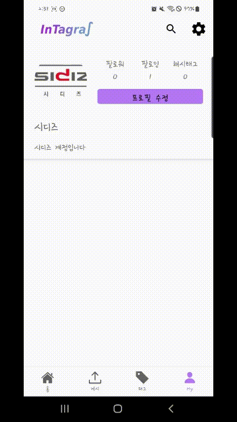
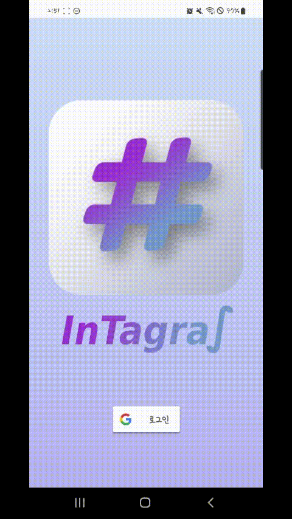
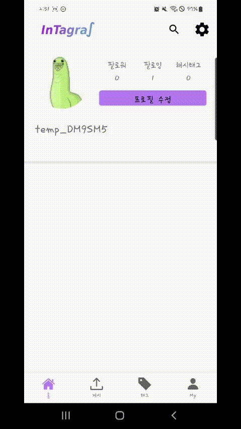
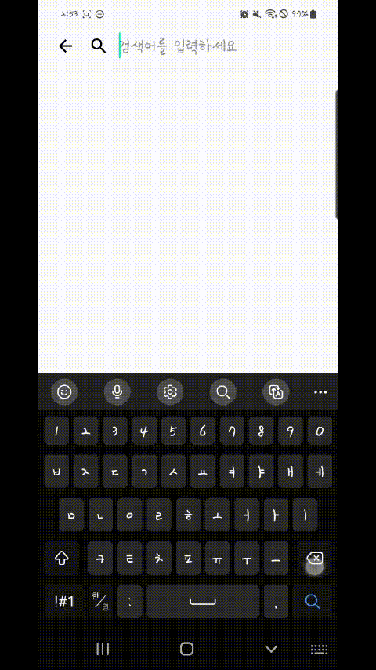
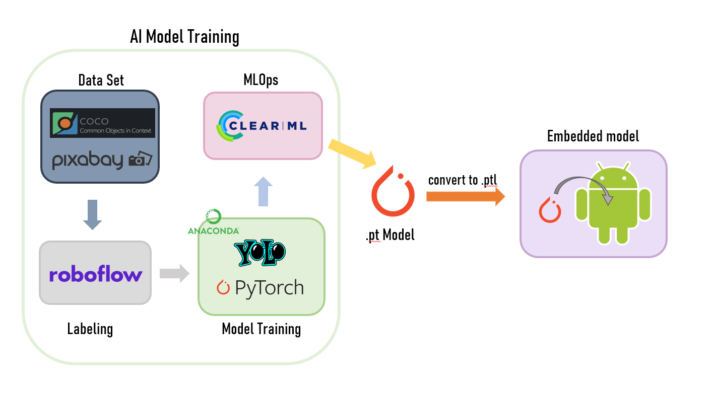
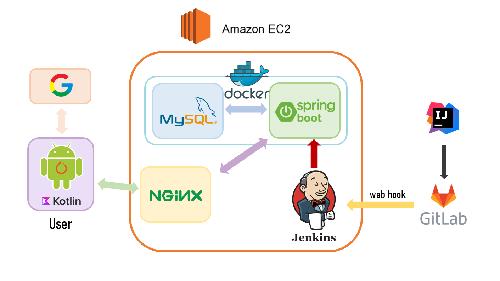
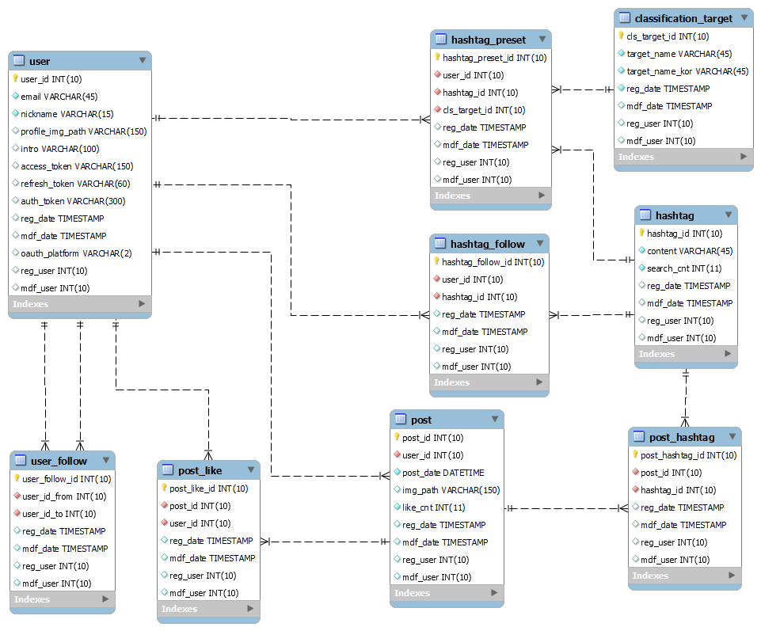
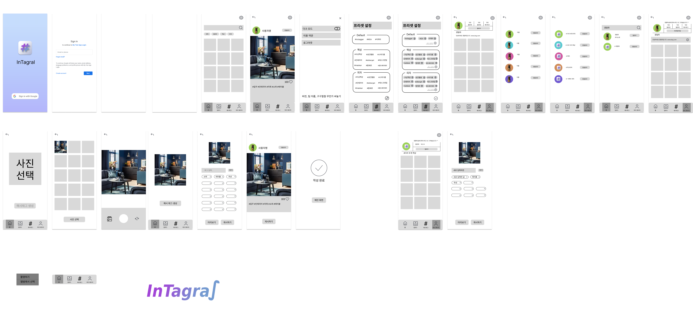

# IntagRa∫


> 인테리어에 관심있는 사람들을 위한 자동 태깅 SNS

개발 기간 2022.10.11 ~ 2022.11.21

# 목차

[1.프로젝트 소개](#프로젝트소개)
[2.주요기능](#주요기능)
[3.개발환경](#개발환경)
[4.기술스택](#기술스택)
[5.시스템 구성도](#시스템구성도)
[6. ERD](#ERD)
[7. 와이어프레임](#와이어프레임)
[8. 팀 소개](#팀소개)

# 프로젝트소개

-   프로젝트명: IntagRa∫
-   서비스 특징: 이미지 분석 & 자동 태깅 SNS 어플리케이션
-   기획 배경
    -   해시태그로 광고, 게시물의 유입률을 높일 수 있는 인스타그램이라는 SNS의 존재
    -   홈 인테리어에 관한 높아지는 사람들의 관심도. 실제로 인스타그램에 홈 인테리어 검색 시 다양한 사진이 나옴
    -   최초 요구사항 명세서에는 강아지, 고양이 인식을 통한 자동 해시태그 생성이었지만 이를 더 확장해서 ‘홈 인테리어’ 타겟으로 기획을 구체화
-   주요 기능
    -   게시글 피드
    -   이미지 분석 & 태그 생성
    -   태그 프리셋
    -   유저, 해시태그 팔로우
-   배포 환경
    -   AWS EC2 Ubuntu 20.04 LTS

# 주요기능

### 1. 게시글


### 2. 이미지 분석 & 태그 추출


### 3. 태그 프리셋



### 4. 유저, 해시태그 팔로우


# 기타 기능

**구글 OAuth**



**프로필 관리**



**검색**



###

# 개발환경

-   Windows (10, 11)
-   AWS Ubuntu 20.04 LTS
-   안드로이드
    -   Android Studio 2021.3.1
    -   테스트 기기 : Galaxy S 10, Galaxy Z Flip 4
-   백엔드
    -   IntelliJ 2022.1
    -   openJDK 11
    -   Spring Boot 2.7.5
    -   Gradle 7.5.1
-   AI
    -   Python
    -   Pytorch
    -   GPU서버
-   데이터베이스
    -   MySQL 5.7
-   인프라
    -   Jenkins 2.361.2
    -   Docker 20.10.12
    -   Nginx 1.18.0

# 기술스택

-   **Back-end**
    
    
    
    -   JPA
-   **Database**

    

-   **AI**

    

    

-   **Infra**

    
    
    
    
    

-   **Cooperation**
    
    
    
    

# 시스템구성도





# ERD



# 와이어프레임



# 팀 소개 - **그 Tag 사람**

```
👦 이득교: 팀장 / AI

🧑 배준성: Backend, Android, Design

🧔 한유연: Android, CI/CD

🧑 정태윤: Android, CI/CD

🧒 성성민: AI

🧒 강봉민: Backend, Infra
```
